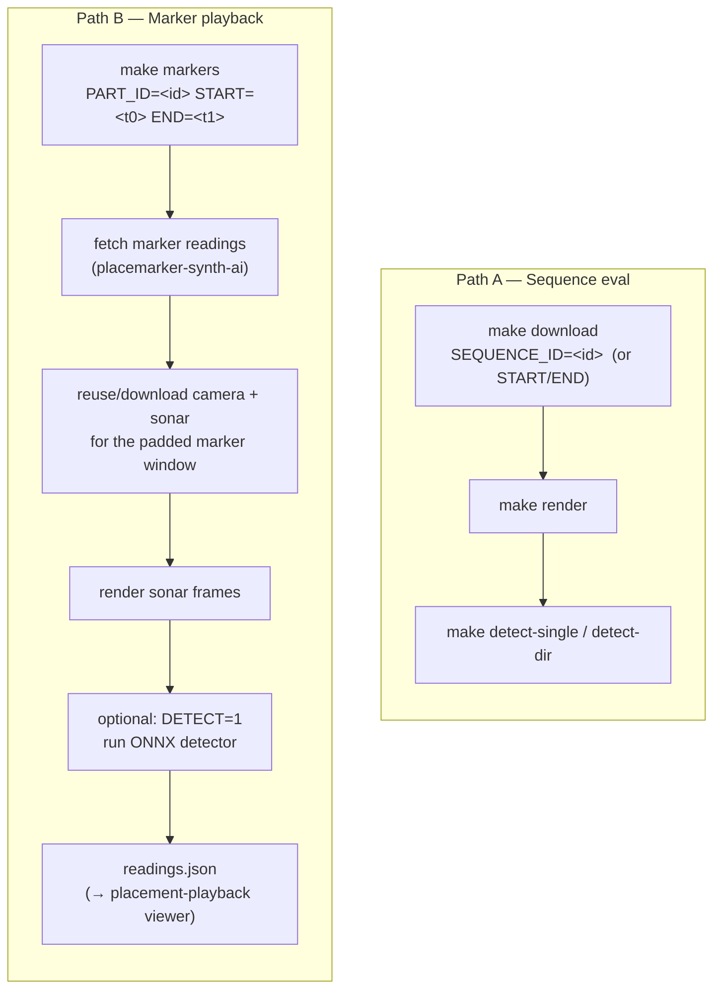
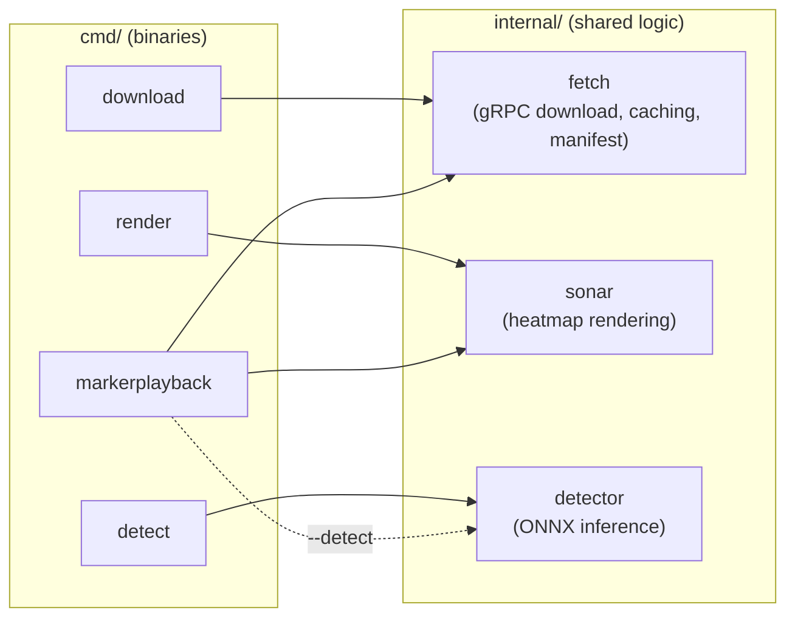

# synthetic-sonar-eval

Tools for pulling sonar/camera data from Viam and evaluating the fish-detection model against it.
The repo supports two independent workflows that share the same download/render/detect building
blocks:

- **Sequence eval** — download a whole recorded sequence (or a raw time range), render the sonar
  pings as heatmap video, and run the ONNX detector over the results.
- **Marker playback** — pull marker-placement ground truth for a part/time-window, sync it with
  camera + sonar frames from that same window, optionally run detection, and hand it all to the
  external `placement-playback` viewer as one JSON file.



## Prerequisites

- Go (version pinned in `go.mod`)
- [ffmpeg](https://ffmpeg.org/) with libx264 (`brew install ffmpeg`) — used by `make render`
- [Viam CLI](https://docs.viam.com/cli/) (`brew install viam`) — used by `make setup`
- [onnxruntime](https://github.com/microsoft/onnxruntime) (`brew install onnxruntime`) — used by
  anything that runs detection (`make detect-single`, `make detect-dir`, `make markers DETECT=1`)

## Component names

Both workflows talk to a fixed set of Viam component names. These aren't configurable via `make`
(they're defaults baked into the Go flags), so a part must expose components with these names for
the tools to find data:

| Data | Component name(s) | Component type | Method |
|---|---|---|---|
| Sonar (4 fans) | `horizontal-h-sensor`, `horizontal-h3-1-sensor`, `horizontal-h3-2-sensor`, `horizontal-h3-3-sensor` | `rdk:component:sensor` | `Readings` |
| Screen camera — time-range download / `make markers` | `camera-save-predictions` | `rdk:component:camera` | `BinaryDataByFilter` |
| Screen camera — sequence download | whatever the sequence's binary data reports (in practice `screen1`) | — | — |
| Marker placements (real + synthetic) | `placemarker-synth-ai` | `rdk:component:sensor` | `Readings` |

## Repo layout



## Usage

### 1. Setup

Logs in via the Viam CLI and writes your auth token to `.env`:

```
make setup
```

This creates a `.env` file containing `VIAM_AUTH_TOKEN`. Re-run any time your token expires. Add
`VIAM_ORG_ID=<id>` to `.env` yourself (or pass `ORG_ID=<id>` on the command line) — it's required
by any command that queries by time range.

### 2. Download (Path A)

`cmd/download` supports two mutually exclusive modes, both keyed on `PART_ID`:

**Mode A — whole recorded sequence:**

```
make download PART_ID=<part-id> SEQUENCE_ID=<sequence-id>
```

Downloads tabular sonar readings and binary camera images for the sequence via Viam's internal
sequence API (gRPC reflection). Resumable — if interrupted, re-running the same command picks up
from `progress.json`.

**Mode B — raw time range:**

```
make download PART_ID=<part-id> START=2026-07-05T00:00:00Z END=2026-07-06T00:00:00Z ORG_ID=<org-id>
```

Downloads screen images (`camera-save-predictions`) and sonar readings (all 4 sensors, via
`TabularDataByMQL` bucketed by `capture_day`) for the window. Windows are capped at **3 days**
(`fetch.MaxQueryWindow`) since some sonar sensors log 250k+ pings across just a few days.

Both modes write into a cache keyed by part ID + a hash of the mode's parameters, so re-running
with the same arguments is a cheap no-op:

```
output/
  <part-id>/
    <hash>/                     # sha256(sequence-id) or sha256(org-id|start|end)
      tabular/
        horizontal-h-sensor/       # sonar readings per sensor
        horizontal-h3-1-sensor/
        horizontal-h3-2-sensor/
        horizontal-h3-3-sensor/
      images/                     # camera frames (screen1 / camera-save-predictions)
      manifest.json
      progress.json               # sequence mode only (checkpointing)
```

Optional flags (passed via `go run` directly if needed):

| Flag | Default | Description |
|---|---|---|
| `--output` | `output` | Output directory |
| `--page-size` | `100` | Page size for tabular pagination (sequence mode) |
| `--image-page-size` | `50` | Page size for image pagination (time-range mode) |

### 3. Render (Path A)

Point `OUTPUT` at the specific download to render, renders sonar pings as heatmap PNGs, encodes
per-sensor MP4s, and creates side-by-side videos:

```
make render OUTPUT=output/<part-id>/<hash>
```

To use custom render tuning, pass a params JSON file via `PARAMS`:

```
make render OUTPUT=output/<part-id>/<hash> PARAMS=params/blackbg.json
```

`params/blackbg.json` in the repo is the checked-in calibrated preset for heatmap colors, dB
scaling, and sigma factors. Omit `PARAMS` to use the built-in defaults.

**Output layout:**

```
output/<part-id>/<hash>/
  sonar-images/
    horizontal-h-sensor/       # rendered PNG frames
    horizontal-h-sensor.mp4
    horizontal-h3-1-sensor/
    horizontal-h3-1-sensor.mp4
    ...
  paired/
    horizontal-h-sensor.mp4    # sonar + screen camera side by side
    horizontal-h3-1-sensor.mp4
    ...
```

Optional flags:

| Flag / Make var | Default | Description |
|---|---|---|
| `--output` / `OUTPUT` | `output` | Output directory (must match download) |
| `--params` / `PARAMS` | _(none)_ | JSON file with render params (e.g. `params/blackbg.json`) |
| `--fps` / `FPS` | `3` | Video frame rate |
| `--size` | `1500` | Sonar image size in pixels |
| `--tabular` / `TABULAR` | `<output>/tabular` | Tabular JSON input directory |

### 4. Detect (Path A)

`cmd/detect` runs the `omni-detector-fcos-0_0_4` ONNX model directly on a single image or a
directory of images (e.g. the `sonar-images/` or `images/` a download/render just produced) — no
part ID or network access required:

```
make detect-single IMAGE=output/<part-id>/<hash>/sonar-images/horizontal-h-sensor/<frame>.png
make detect-dir    DIR=output/<part-id>/<hash>/sonar-images/horizontal-h-sensor
```

Optional flags: `MODEL_DIR` (default `omni-detector-fcos-0_0_4`) and `CONFIDENCE` (default `0.6`),
both settable as `make` variables.

### 5. Marker playback (Path B)

Pulls marker-placement sensor readings (`placemarker-synth-ai`) for a single part over
`[START, END]` via `TabularDataByMQL`, then automatically syncs in the camera + sonar data for that
same window and writes a single JSON file for the `placement-playback` viewer (now a separate
repo — load `readings.json` directly into it):

```
make markers PART_ID=<part-id> ORG_ID=<org-id> START=2026-07-05T00:00:00Z END=2026-07-06T00:00:00Z
```

`ORG_ID` is required (flag or `VIAM_ORG_ID` in `.env`). `START`/`END` are required and, like
download mode B, capped at a 3-day window.

What it does, step by step:

1. Queries `placemarker-synth-ai` readings for `PART_ID` in `[START, END]`.
2. Narrows to the actual span the returned readings cover (padded ±5m via `--window-pad`), so the
   camera/sonar pull below isn't wasted on the whole `START`/`END` window.
3. Ensures screen images (`camera-save-predictions`) and sonar readings (all 4 sensors) for that
   padded window are downloaded — reusing the cache from step 2's mode-B download if one already
   exists for the same part/org/window.
4. Renders the sonar readings to heatmap PNGs (same renderer as `make render`).
5. **Optional** (`DETECT=1`): runs the ONNX detector over every camera frame and sonar frame and
   attaches the detections. A missing onnxruntime lib/model is a soft failure — the rest of the
   pull still succeeds, just without detections.
6. Writes everything (readings + base64-embedded images/sonar frames + any detections) to one JSON
   file for the viewer.

```
make markers PART_ID=<part-id> ORG_ID=<org-id> START=... END=... DETECT=1
```

**Output layout:**

```
output/<part-id>/<hash>/          # same cache dir shape as download mode B
  marker-playback/
    readings.json            # { "readings": [...], "images": [...], "sonarFrames": [...] } — load directly into placement-playback
```

Optional flags (passed via `go run` directly if needed):

| Flag | Default | Description |
|---|---|---|
| `--org-id` / `ORG_ID` | _(from `VIAM_ORG_ID`)_ | Organization ID (required) |
| `--start` / `START` | _(none, required)_ | Only readings at/after this RFC3339 `time_received` |
| `--end` / `END` | _(none, required)_ | Only readings at/before this RFC3339 `time_received` |
| `--window-pad` | `5m` | Padding applied around the placed-marker span when scoping the camera/sonar download |
| `--image-page-size` | `50` | Page size for image pagination |
| `--detect` / `DETECT=1` | `false` | Run object detection on fetched images/sonar frames and attach results (opt-in) |
| `--model-dir` / `MODEL_DIR` | `omni-detector-fcos-0_0_4` | Directory containing `model.onnx` + `labels.txt` |
| `--confidence` / `CONFIDENCE` | `0.6` | Minimum detection confidence to record |
| `--onnxruntime-lib` | _(auto-detected)_ | Path to `libonnxruntime.{dylib,so}` |
| `--output` / `OUTPUT` | `output` | Output directory |

### 6. Build binaries

```
make build
```

Compiles `bin/download`, `bin/render`, `bin/markerplayback`, and `bin/detect`.

### Full runs

**Path A — sequence eval:**

```
make setup
make download PART_ID=<part-id> SEQUENCE_ID=<sequence-id>
make render OUTPUT=output/<part-id>/<hash> PARAMS=params/blackbg.json
make detect-dir DIR=output/<part-id>/<hash>/sonar-images
```

**Path B — marker playback, with detection:**

```
make setup
make markers PART_ID=<part-id> ORG_ID=<org-id> START=2026-07-05T00:00:00Z END=2026-07-06T00:00:00Z DETECT=1
```
