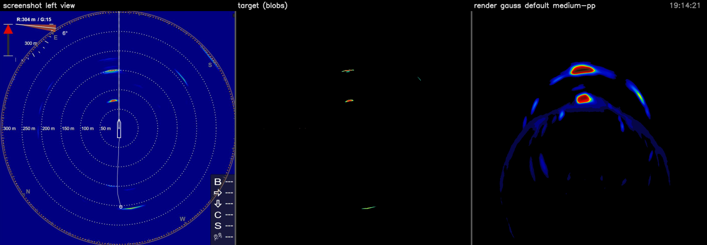
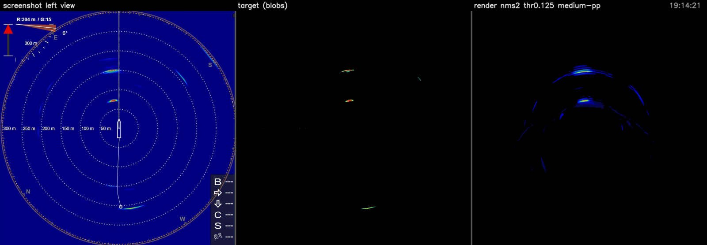
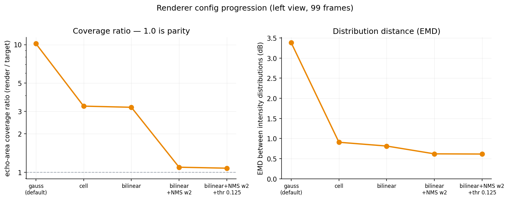
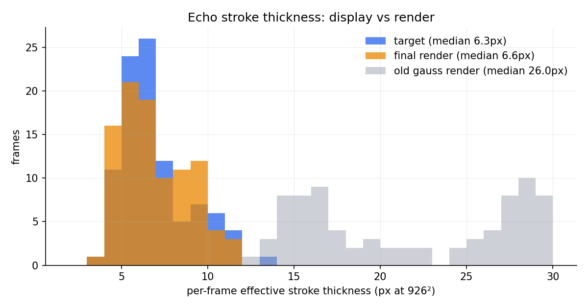

# Renderer calibration — pickup & review guide

This documents how to reproduce, extend, or review the renderer-calibration work: making
`synthetic-sonar-eval` renders match what the vessel's SIMRAD display draws, measured
directly against screenshot-derived targets.

**Status.** Calibrated on one 99-frame clip, left view (`horizontal-h` fan). Best config is
committed as [`params/display-calibrated-0.0.2.json`](../../params/display-calibrated-0.0.2.json)
(presets are versioned: 0.0.1 = kernel/NMS/palette calibration, 0.0.2 = + the −96 dB signal floor):
echo-area coverage **1.08×** the display's, intensity-distribution distance (EMD)
**0.61 dB**, stroke thickness within **3%**. Starting point was 10.2× / 3.38 dB.

**Where the work lives:**

- Renderer + metrics toolkit (this repo): [viam-labs/synthetic-sonar-eval#5](https://github.com/viam-labs/synthetic-sonar-eval/pull/5)
- Target-building pipeline: [viam-modules/kongsberg-training-utils](https://github.com/viam-modules/kongsberg-training-utils)




*Panels: cropped screenshot view | blob-only target | render colorized through the measured
display palette. Top: old Gaussian default. Bottom: `display-calibrated-0.0.1.json`.*

---

## Prerequisites

| what | detail |
|---|---|
| this repo | branch `render-kernels` (PR #5), Go ≥ 1.26 |
| [`kongsberg-training-utils`](https://github.com/viam-modules/kongsberg-training-utils) | for target extraction (its own `.venv` covers its dependencies) |
| Python env for `tools/` | any Python ≥ 3.10 with `opencv-python`, `numpy`, `matplotlib` — nothing else; reusing the kongsberg-training-utils `.venv` works since it already has all three |
| Viam access | `viam` CLI logged in (for downloading sequences) |

Below, `<clip>` is a downloaded sequence directory (e.g.
`output/b073f310-…/7931d1d96b8d`) and `<targets>` a **sibling** directory for derived data
(e.g. `output/b073f310-…/7931d1d96b8d_targets`). Keep targets *outside* the sequence
directory: re-downloads wipe the sequence directory.

## Step 1 — download the sequence

```bash
make setup                     # writes .env with a fresh viam auth token
make download PART_ID=<part-id> SEQUENCE_ID=<sequence-id>
```

Data lands under `output/<part-id>/<hash>/` with `images/screen1/` (display screenshots,
1 Hz), `tabular/<fan>-sensor/` (raw ping JSON per fan: `horizontal-h`, `horizontal-h3-1/2/3`),
`manifest.json`, `progress.json`. Verify `progress.json` says `"binaryDone": true` and that
`images/screen1` is non-empty — an interrupted download leaves a half-empty directory and
*will* silently skip on retry (delete the hash directory to force a re-download).

The clip everything in this guide was calibrated on:

```bash
make download PART_ID=b073f310-deca-434b-9f87-8cb388f10316 \
              SEQUENCE_ID=1b8e6ca3-e545-4d1d-aaec-79e7d7f0e5d5
# → output/b073f310-…/7931d1d96b8d   (99 frames, 2026-07-08, SIMRAD blue skin, dual layout)
```

## Step 2 — build the targets

A *target* is a clean, comparable sonar view extracted from a screenshot. The extraction
pipeline lives in
**[kongsberg-training-utils](https://github.com/viam-modules/kongsberg-training-utils)** —
see that repo's README and `docs/render-calibration-roadmap.md` for how each stage works
and was validated. From its repo root, with its venv, one
command runs the whole extraction (crop views → strip background → strip overlays) and
prints a CHECKPOINTS block telling you what to eyeball:

```bash
python src/sonar/build_targets.py  <clip>/images/screen1  <targets>
# writes <targets>/{views, views_stripped, views_blobs} (+ _debug/ trees)
```

Then two tools from **this repo** finish the job:

```bash
# measure the display's color palette from the on-screen legend bar
python tools/extract_palette.py  <clip>/images/screen1  <targets>/palette/palette.json \
    --debug-dir <targets>/palette

# invert the blob targets from display colors to grayscale signal space
python tools/invert_targets.py   <targets>/views_blobs  <targets>/palette/palette.json \
    <targets>/views_signal
```

**Checkpoints before trusting the targets:**

- `build_targets.py` streams each stage and ends with a CHECKPOINTS block: the crop stage
  should report `0 partial, 0 skipped` (spot-check `<targets>/views/_debug/` fitted-circle
  overlays), and `<targets>/views_blobs/_debug/` side-by-sides should show echo arcs
  intact with no UI remnants (compass letters, tilt wedge, legend bar, rim tick-ring).
- `extract_palette.py` prints the gate-valid window, e.g. `gate-valid u range:
  [0.125, 0.910] = [-95.5, -67.2] dB`, and writes `palette_ramp.png` — it should look like
  the legend bar on-screen (blue → green → yellow → red → dark tail). These two numbers
  are the comparison window used by every metric; if they differ wildly from the above,
  the legend detection failed.

## Step 3 — render and get the numbers

```bash
# render all fans: writes colorized sonar-images/ AND grayscale sonar-signal/ (the metric input)
make render OUTPUT=<clip> PARAMS=params/display-calibrated-0.0.2.json PINGPINGFILTER=medium

# score the left view against the targets
python tools/compare_1d.py <targets>/views_signal <clip>/sonar-signal/horizontal-h-sensor \
    <targets>/palette/palette.json <out_dir> --side left
```

`compare_1d.py` pairs frames by nearest timestamp (gaps here are ~10 ms) and prints/writes
`summary.json`. The fields that matter:

| field | meaning | value for this clip + preset |
|---|---|---|
| `median_cov_render / median_cov_target` | **coverage ratio** — echo pixels per disk area, render ÷ target. 1.0 = parity | **1.08** |
| `pooled_emd_db` | **EMD** — earth mover's distance between pooled intensity distributions, in dB | **0.61** |
| `pooled_shift_db` | mean intensity difference render − target (the first moment of EMD) | **−0.35** |
| `median_fill_radius_*` | how far out (fraction of disk radius) content reaches — a geometry sanity check | ~0.9–1.0 |

Also written: `per_frame.csv`, `pooled_hist.png` (target vs render intensity distributions
— compare envelopes, not the target's quantization spikes), `per_frame.png`,
`eyeball/*.png`.

Small drifts (±0.1 coverage, ±0.1 dB) across re-downloads are normal (JPEG decode,
timestamp pairing); order-of-magnitude changes are not.

**Display-style signal floor.** Renders default to `--signal-floor-db -96`: signal
below −96 dB is zeroed *after* the ping-ping filter (the pre-EMA `heatmapMinThreshold`
cannot do this — EMA decay reintroduces sub-threshold ghosts). This suppresses the
low-intensity haze (weak arcs, noise rings) that the vessel display doesn't draw but
that dominates renders visually while counting zero in every windowed metric. The
value was picked by eye with `tools/threshold_study.py` (per-frame
`[screenshot | target | raw | ≥t…]` composites) on two clips — −96 sits just below
this clip's gate window (−95.5), so metric numbers barely move. `-100` disables.
Caveat from the second clip (G:21): its noise floor is higher and −96 leaves ring
residue — a gain-dependent or adaptive floor is the open follow-up.

### Component matching (spatial structure)

> **Status 2026-07-22: metric-driven tuning is paused.** The matched/unmatched
> decision is pixel-zone based (echo pixels within a dilation tolerance of the
> other side's mask), not the explicit blob↔blob pairing the overlay suggests
> is needed for review; and the visually dominant low-intensity haze counts
> zero in every windowed metric. The tools remain for reference; the immediate
> fix for the haze is the render-side `--signal-floor-db` (see below).

`compare_1d.py`'s numbers are aggregates — coverage can be faked by fragmentation, and
the histogram can't say *where* mass sits. `compare_components.py` matches echo structure
spatially (same CLI shape):

```bash
python tools/compare_components.py <targets>/views_signal <clip>/sonar-signal/horizontal-h-sensor \
    <targets>/palette/palette.json <out_dir> --side left
```

It derives intensity bands from the measured palette's hue transitions (green / yellow /
orange / red on this skin), matches target↔render echo masks with a small spatial
tolerance (`--tol-px`, default 6 ≈ one display stroke width), and reports per band:

| field | meaning | value for this clip + preset |
|---|---|---|
| `mass_matched_frac_target` | display mass the render reproduces within tol (recall) | **0.67** |
| `mass_matched_frac_render` | render mass the display actually draws (precision) | **0.71** |
| `fragmentation_median` | render comps per target comp among matched clusters — speckle-gaming shows as ≫ 1 | **1.0** |
| `bands[k].delta_db_median` | matched-component intensity delta, symmetric binning | green +0.3 → red **−3.9** |
| `bands[k].delta_db_p90_median` | same on p90 (robust to the render's stroke-taper flanks) | red **−1.9** |
| `bands[k].target_unmatched_render_state` | for missed display mass: is the render `silent` there or `sub_window` (energy just below the gate = under-driven)? | ~50/50 in every band |

Matched fractions scale smoothly with `--tol-px` (0.50 @3 px → 0.77 @10 px) — treat them
as *comparative* numbers at fixed tolerance, not absolute scores. Delta-dB is reported
under symmetric binning (band of the target/render mean) because binning by target
intensity alone imports a regression-to-the-mean artifact (~±1 dB on this clip).
Also written: `delta_db.png`, `unmatched_mass.png`, `per_frame.png`, `per_component.csv`,
and `eyeball/*.png` overlays (target-only blue, render-only orange, matched white) for
the evenly-spaced, worst-miss, and worst-phantom frames.



## Step 4 — visual check (do not skip)

The aggregate metrics can be gamed — a small-sigma Gaussian config reached coverage 1.15 as
disconnected dot-speckle. Every config change needs an eyeball pass:

```bash
python tools/visualize_result.py <targets> <clip>/sonar-signal/horizontal-h-sensor <viz_dir> \
    --label "my config"
```

Writes per-frame `[screenshot | target | render]` composites + `composite.mp4`. Checklist:

- echo clusters at the same bearing and range as the screenshot (geometry);
- contiguous strokes — no dot-speckle (sigma too small), no beam-cell blockiness;
- stroke thickness comparable to the display's thin arcs — no fat halos;
- no "blue carpet" of sub-threshold noise;
- radially thick schools not split into concentric "onion rings" (known NMS risk — check
  the dense-school frames).

## Optional — sweeps and diagnostics

| tool | use it when |
|---|---|
| `tools/splat_sweep.sh <clip>` | grid-sweep render params, each config scored with compare_1d. Grid via env vars: `RANGES="0.5 1.0" ARCS="0.25" THRS="0.1" SKIP_PP=1 JOBS=6 bash tools/splat_sweep.sh <clip>`. Results → `collect_sweep.py` table ranked by \|log cov-ratio\|, EMD tiebreak |
| `tools/gate_sweep.sh <clip>` | grid-sweep the gate/gain knobs (`heatmapMinThreshold` × `dbOffset` × `radialPeakWindow` × ping-ping), scored with compare_components + compare_1d. Grid via env vars: `THRS="0.125 0.05" OFFSETS="0 2 2.5" PPS="weak medium" NMSS="2" JOBS=6 bash tools/gate_sweep.sh <clip>`. Completed runs are skipped, so the grid extends across invocations. Results → `collect_gate_sweep.py`, ranked by matched mass |
| `tools/angle_check.py` | suspected rotation/heading mismatch. Circular cross-correlation of angular echo profiles vs `heading_deg`. Verdict on this clip: median offset 1.4°, no heading dependence — no rotation correction |
| `tools/shift_sweep.py` | test whether a residual mismatch is a constant dB offset (sweeps an offset, reports EMD + coverage vs shift). Used to rule out gain as the explanation for the skirt excess |

Two implementation notes that will save you an afternoon: ping-ping `off` cannot be
scored — the renderer only writes `sonar-signal/` when the filter is on; and sweep renders
must go to separate output dirs (the renderer clears `sonar-images/`/`sonar-signal/` on
every run).

## Metric blind spots (for reviewers)

- **Coverage ratio** counts pixels; it cannot see *where* they are, and parity can be
  faked by fragmentation. Always pair with the visual check (and with stroke thickness:
  4×mean distance transform of the echo mask — display ≈ 6.3 px at 926², see below).
- **EMD** compares normalized distributions; it cannot see total area or geometry.
- **Everything** is restricted to the gate-valid window. Below it (the display's faint
  blue) the target carries no information — differences there are invisible to the metric
  and must be judged against the *screenshot*, not the target.



## Known gaps / where to pick up

1. **Weak-band gap: quantified, then retuned (2026-07-13 gate/gain sweep)** — the
   component-matching metric localized the residual mismatch, and
   `tools/gate_sweep.sh` (threshold × `dbOffset` × NMS × ping-ping, 22 configs) tested
   the knobs. What the sweep established:
   - **Strong-echo coldness is a constant gain deficit and is fixed.** The matched-
     component p90 delta climbs monotonically with `dbOffset` and crosses zero at
     **+2.5 dB** (−1.9 → +0.14). No preset file is committed (repo decision: no new
     config files) — set `"dbOffset": 2.5` in a params JSON to reproduce.
     Caveat: measured at this clip's G:15 — a different display gain setting likely
     needs a different offset (second-clip item below).
   - **`heatmapMinThreshold` is not a lever**: it gates the final signal pre-EMA, so
     lowering it only reveals sub-window arcs at their true values (green matched moved
     < 1 pt from 0.125 → 0.05).
   - **Ping-ping medium confirmed**: weak overshoots peaks by +4–6.5 dB and collapses
     render-side precision to ~0.55. `radialPeakWindow` 3 gains nothing over 2.
   - **The remaining weak-arc mismatch is structural, not gain**: mean matched mass is
     flat (~0.69) at every offset — recall converts to precision loss ~1:1 (green
     matched 0.52→0.59 target-side while 0.60→0.49 render-side). Display and render
     disagree about *which* near-threshold arcs exist, not how bright they are.
     Candidate mechanisms for whoever picks this up: display-side weak-echo processing
     (persistence/despeckle), target under-count of anti-aliased weak arcs, EMA state
     mismatch on moving fish; on dense-school frames the match overlays show
     *interleaved* thin arcs (different ridge picks — see the NMS caveat below).
     A second clip would also say how much of this is clip-specific.
2. **Right view** — needs `h3-1/2/3` composited into one image in grayscale signal space
   (max-per-pixel is the first guess), then the same battery. Caution: on some frames the
   on-screen right view is *not* a composite; there is no marker for this yet, so expect
   (and tolerate) bad pairs.
3. **NMS onion rings** — per-sample radial NMS can split a radially thick school into
   concentric ridges. If it proves objectionable, switch to per-run peak bands (one ridge
   per contiguous echo run along range).
4. **Single-clip calibration** — everything above is one clip, one skin, one range
   setting (left R:304 m, G:15). Validating on a second clip (different range/gain/skin)
   is the cheapest way to find overfitting.

## Full history

The decision log — every experiment, rejected hypothesis, and measured number — lives in
[`kongsberg-training-utils`](https://github.com/viam-modules/kongsberg-training-utils) at `docs/render-calibration-roadmap.md`.
